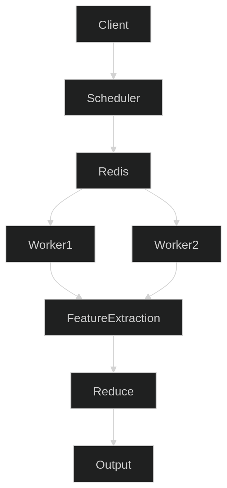

# ChunkFlow

ChunkFlow is a distributed dataset processing pipeline designed to execute feature extraction workloads across multiple worker nodes.

The system uses a scheduler-worker architecture with chunk-based dataset partitioning and Redis-backed task coordination.

## Architecture

## Project Goals

- Implement a distributed scheduler-worker processing model
- Demonstrate a chunk-based dataset partitioning
- Implement fault-torelant task execution
- Provide observability and worker monitoring

## Tech Stack

Scheduler: Python + FastAPI
Workers: Python orchestration
Task Store: Redis
Compute tasks: C++
Communication: HTTP REST

## Status

🚧 Work in progress
