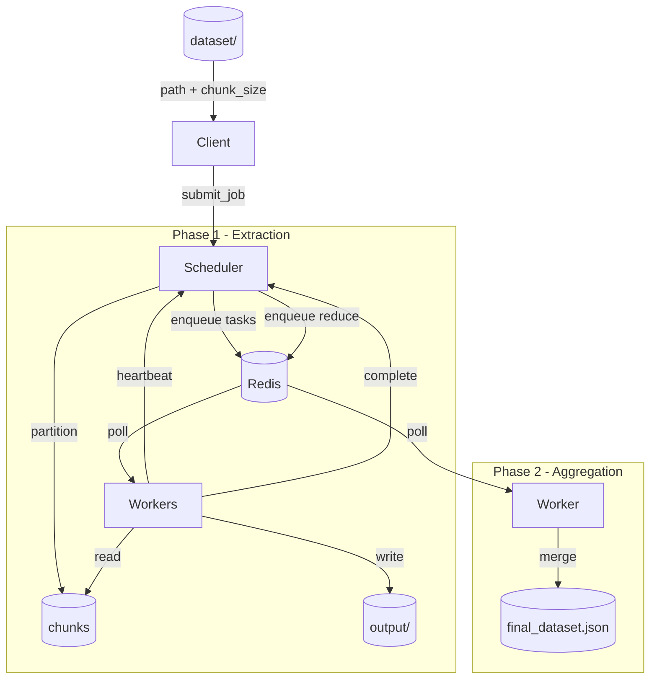

# ChunkFlow Architecture

## Overview

ChunkFlow is a distributed dataset processing pipeline that executes feature extraction workloads across multiple worker nodes. It follows a scheduler-worker architecture inspired by systems like Apache Spark and Ray, using Redis as a coordination layer for task distribution and state tracking.

---

## Components

### Client

A lightweight HTTP client that submits processing jobs to the scheduler. It sends the dataset path and chunk size, then receives a job ID in return.

### Scheduler

A FastAPI service that acts as the central coordinator. Responsibilities:

- Receives job submissions from clients
- Partitions datasets into chunks and creates tasks
- Enqueues tasks to Redis for workers to consume
- Tracks job and task state
- Monitors active workers via heartbeats
- Enqueues a reduce task once all feature extraction tasks for a job are complete
- Exposes metrics (active workers, pending tasks, running tasks)

### Redis

The distributed coordination layer. Stores:

- **Task queue** — list of pending tasks workers poll from
- **Running tasks** — set of task IDs currently being executed
- **Completed tasks** — set of task IDs that have finished
- **Job registry** — mapping of job IDs to their task IDs
- **Worker heartbeats** — sorted set of worker IDs scored by last heartbeat timestamp

### Worker Nodes

Stateless worker processes that poll the scheduler for tasks and execute them. Each worker:

- Generates a unique worker ID on startup
- Sends periodic heartbeats to the scheduler
- Polls `GET /task` for available work
- Dispatches tasks to the appropriate handler based on task type
- Reports completion via `POST /task/{task_id}/complete`

Multiple workers can run concurrently and process tasks from the same job in parallel.

### Processing Tasks

Tasks are typed and dispatched by the worker executor:

- **`feature_extraction`** — reads a dataset chunk, computes `value_normalized` and `value_squared` for each record, and writes results to an intermediate file in `output/<task_id>.json`
- **`reduce`** — reads all intermediate output files for a job, merges and sorts the results, and writes the final dataset to `output/final_features_dataset.json`

### Reduce Stage

The reduce task is enqueued by the scheduler once all feature extraction tasks for a job complete. A worker picks it up and aggregates all intermediate results into a single output file. This keeps all compute on the worker side and the scheduler as a pure coordinator.

---

## Execution Flow

### 1. Job Submission

The client sends a `POST /submit_job` request with a dataset path and chunk size. The scheduler generates a job ID and proceeds to partition the dataset.

### 2. Dataset Partitioning

The scheduler reads the dataset JSON file and splits it into fixed-size chunk files written to the `dataset/` directory (e.g. `sample_dataset_chunk_1.json`). One task is created per chunk.

### 3. Task Scheduling

Each feature extraction task is enqueued to Redis. The scheduler also registers the job, storing the mapping between the job ID and its task IDs.

### 4. Worker Execution

Workers poll `GET /task` and receive one task at a time. The scheduler marks the task as running in Redis and the worker dispatches it to the appropriate handler. Upon completion, the worker calls `POST /task/{task_id}/complete`.

### 5. Result Aggregation

After each task completion, the scheduler checks whether all tasks for the job are done. When the last task completes, a reduce task is enqueued. A worker picks it up, reads all intermediate output files, merges and sorts the records by ID, and writes `output/final_features_dataset.json`.

---

## Architecture Diagram

